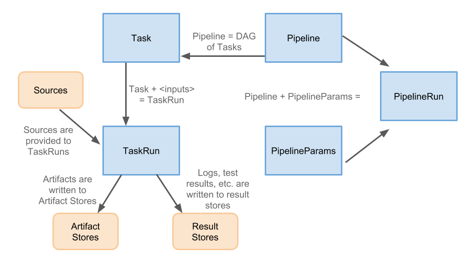

# The pipeline CRD Strawman

The goal of the Pipeline CRD is to provide k8s-style resources that allow the
declaration of CI/CD-style pipelines.

Features the Pipeline CRD will support include:

* Conditional, parallel and distributed execution
* Interaction with CI/CD resources such as source code, artifacts, results, deployments and clusters

The goal of the Pipeline CRD is to fit into and cooperate with
[the knative ecosystem](https://github.com/knative/docs#welcome-knative), specifically:

* [The Build CRD](https://github.com/knative/docs/blob/master/build/builds.md)
* [The Eventing APIs](https://github.com/knative/eventing/tree/master/docs/spec)

## CRD Types

The CRDs involved are:

* [TaskRun](#taskrun)
* [PipelineRun](#pipelinerun)
* [Task](#task)
* [Pipeline](#pipeline)
* [PipelineParams](#pipelineparams)

High level details of this design:

* [Pipelines](#pipelines) do not know what will trigger them, they can be
   triggered by events or by manually creating [PipelineRuns](#pipelinerun)
* [Tasks](#tasks) can exist and be invoked completely independently of
  [pipelines](#pipelines); they are highly cohesive and loosely coupled
* Test results are a first class concept, being able to navigate test results
  easily is powerful (e.g. see failures easily, dig into logs, like sponge)
* [Tasks](#tasks) can depend on artifacts, output and parameters created by other tasks.

### TaskRun

Creating a `TaskRun` will invoke a [Task](#task), running all of the steps until completion
or failure. Creating a `TaskRun` will require satisfying all of the input requirements of the
`Task`.

`TaskRuns` are basically [knative Builds](https://github.com/knative/build) with inputs and
outputs.

`TaskRuns` can be created directly by a user or by a [PipelineRun](#pipelinerun).

### PipelineRun

Creating a `PipelineRun` executes the pipeline, creating [TaskRuns](#taskrun) for each task
in the pipeline.

`PipelineRuns` tie together a [Pipeline](#pipeline) and a [PipelineParam](#pipelineparam).
A `PipelineRun` could be created:

* By a user manually
* In response to an event (e.g. in response to a Github event, possibly processed via
  [knative eventing](https://github.com/knative/eventing))

### Task

`Task` is a CRD that knows how to instantiate a [Knative Build](https://github.com/knative/build),
either from a series of `steps` (i.e. [Builders](https://github.com/knative/docs/blob/master/build/builder-contract.md))
or from a [`BuildTemplate`](https://github.com/knative/docs/blob/master/build/build-templates.md).
It takes Knative Build and adds inputs and outputs. Where these inputs and outputs are provided
from is not known to a task, so they can be provided by a Pipeline or by a user invoking a Task directly.

`Tasks` are basically [knative BuildTemplates](https://github.com/knative/build-templates)
with additional input types and clearly defined outputs.

### Pipeline

`Pipeline` describes a graph of [Tasks](#task) to execute. It defines the DAG
and expresses how all inputs (including [PipelineParams](#pipelineparams) and outputs
from previous `Tasks`) feed into each `Task`. It allows for fan in and fan out, and
ordering can be expressed explicitly using `prev` and `next`, or it can be inferred
from a `Task’s` inputs.

Dependencies between parameters or inputs/outputs are expressed as references to k8s objects.

### PipelineParams

`PipelineParams` contains parameters for a [Pipeline](#pipeline). One `Pipeline`
can be invoked with many different instances of `PipelineParams`, which can allow
for scenarios such as running against PRs and against a user’s personal setup.
`PipelineParams` can control:

* What **sources** the `Pipeline` runs against
* Which **serviceAccount** to use (provided to all tasks)
* What **artifact** stores are used (e.g. Docker registries)
* Where **results** are stored (e.g. in GCS)
